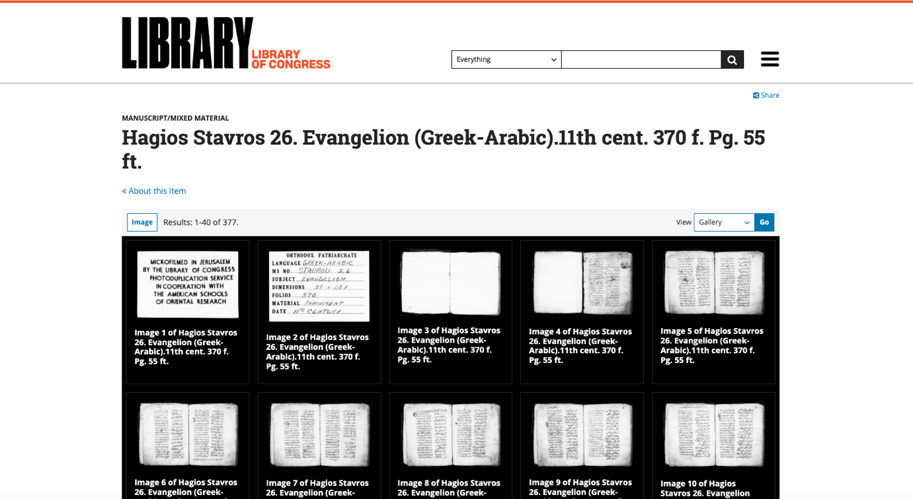
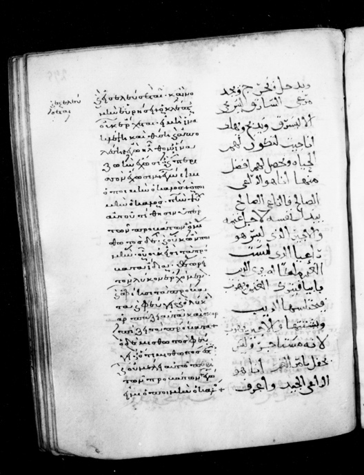
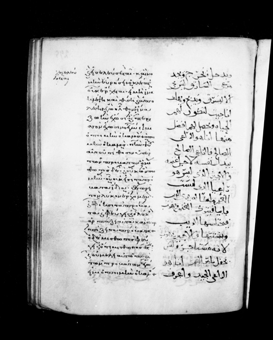
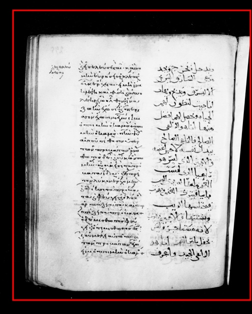
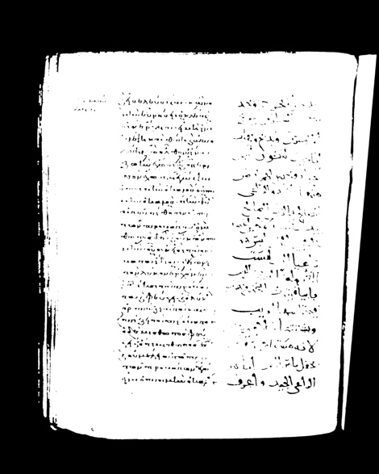
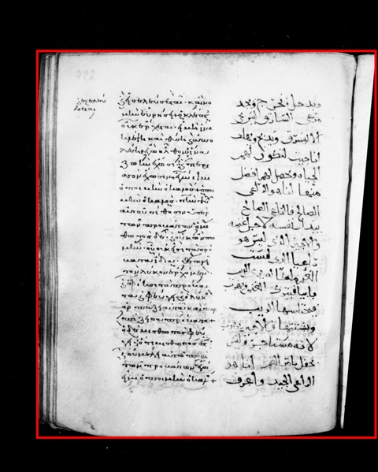

## The Facsimile Revolution

Facsimiles of historical manuscripts are available today at an unprecedented scale. From almost anywhere in the world, scholars can view and often download ancient and medieval manuscripts from collections such as the Vatican, the Bibliothèque nationale de France, St Catherine's Sinai, and the University of Cambridge.

Once these images have been obtained, however, the challenge becomes how to work with them efficiently, reproducibly, and at scale. Fortunately, there is a large ecosystem of open-source tools that can assist with processing manuscript images. Many of these tools follow the Unix philosophy of "do one thing and do it well".[^salus] Individually, the programs are small and specialised, but they can be combined into powerful and flexible workflows.

The examples in this paper use Unix-style command-line conventions and should work directly on Linux and macOS systems. Windows users can either adapt the commands to PowerShell or use a Unix-like shell environment such as Windows Subsystem for Linux, Git Bash, or Cygwin.

[^salus]: Peter H. Salus, *A Quarter Century of UNIX* (Reading, MA: Addison-Wesley, 1994), 53, <https://dl.acm.org/doi/book/10.5555/191771>.

## Case Study

To illustrate these tools, we will use a case study of Jerusalem Agios Stavros 26, an eleventh-century Greek-Arabic lectionary written on parchment, with the Gregory-Aland number L1023. The Greek text appears on the left column and the Arabic text on the right, with the manuscript ordered from left to right.[^turnbull]

In 1949 and 1950, the Library of Congress sent an expedition led by Kenneth Clark to Jerusalem and St Catherine's Monastery at Mount Sinai to microfilm manuscripts.[^clark] These microfilms have since been digitised, placed in the public domain, and made available through the Library of Congress website.[^loc]

{#fig-loc width="100%"}

[^turnbull]: Robert Turnbull, *Codex Sinaiticus Arabicus and Its Family: A Bayesian Approach*, vol. 66 of New Testament Tools, Studies and Documents (Leiden: Brill, 2025), 142, <https://brill.com/display/title/69300>.
[^clark]: Kenneth Clark, "Microfilming Manuscripts at Jerusalem and Mt. Sinai," *Bulletin of the American Schools of Oriental Research* 123 (1951): 17-24.
[^loc]: <https://www.loc.gov/resource/amedmonastery.00279395517-jo>

## Downloading

The first step is to download the images. We can download an image using Wget, a non-interactive command-line tool for retrieving files from the internet.[^wget] It is available on Linux, macOS, and Windows. The basic usage of Wget takes the following form, where you provide the URL you want to download and the path where you wish to save the output.

```bash
wget -O "$output" "$url"
```

The Library of Congress provides downloadable full-resolution images for each two-page spread. The images are served using the International Image Interoperability Framework (IIIF), so the URLs follow a predictable pattern with a base URL like this:[^iiif]

```bash
https://tile.loc.gov/image-services/iiif/service:amed:amedmonastery:00279395517-jo
```

The suffix includes a zero-padded four-digit page number:

```bash
:0001/full/pct:100/0/default.jpg
```

To download these images, create a new directory:

```bash
mkdir -p Stavros26-LOC
```

Single images may be downloaded as follows:

```bash
base_url="https://tile.loc.gov/image-services/iiif/service:amed:amedmonastery:00279395517-jo"
page="001"
url="${base_url}:0${page}/full/pct:100/0/default.jpg"
output="Stavros26-LOC/Stavros26_${page}.jpg"

wget -O "$output" "$url"
```

This command downloads the image into the newly created directory.

There are 377 images in this microfilm collection. To download them all, we can use a loop:

```bash
for page in $(seq -w 1 377); do
    url="${base_url}:0${page}/full/pct:100/0/default.jpg"
    output="Stavros26-LOC/Stavros26_${page}.jpg"

    wget -O "$output" "$url"
    sleep 2
done
```

Here we are using a simple Bash loop to download every page image from the manuscript automatically instead of downloading them one by one manually. The `seq` command generates the page numbers from 1 to 377, and the `-w` option pads the numbers with leading zeros so that the formatting matches the way the files are named on the server. For each page number, we construct the IIIF URL dynamically using the `base_url` together with the current page number. We also create a corresponding output filename for the downloaded image.

Finally, the `sleep 2` command pauses for two seconds between downloads. This avoids sending hundreds of requests to the IIIF server all at once, which is more polite to the server and reduces the risk of being rate limited or blocked.

{#fig-downloaded width="70%"}

[^wget]: GNU Project, "GNU Wget," 2026, <https://www.gnu.org/software/wget/>.
[^iiif]: Stuart Snydman, Robert Sanderson, and Tom Cramer, "The International Image Interoperability Framework (IIIF): A community & technology approach for web-based images," in *Proceedings of IS&T Archiving 2015*, 2015, 16-21, <https://doi.org/10.2352/issn.2168-3204.2015.12.1.art00005>.

## Splitting

All the images have now been downloaded. Each microfilm image contains two manuscript pages microfilmed together in a single frame. To make the images easier to read and process, we first want to split each image into separate sides.

Since the gutter appears consistently near the centre of the images, we can use a simple Python tool called MSS Tools, developed by me and Peter Montoro, to split the images automatically.[^msstools] It is best to install this program inside a Python virtual environment so that it does not affect the system-wide Python installation:

```bash
python3 -m venv .venv
source .venv/bin/activate
pip install msstools
```

MSS Tools includes a command called `split-images`, which separates left and right pages while preserving a small overlap around the gutter. This overlap helps ensure that text near the binding is not lost during the split.

The simplest usage is:

```bash
msstools split-images \
    "Stavros26-split/Stavros26" \
    Stavros26-LOC/*.jpg
```

We will use a few custom options provided by the tool. By default, the images are split with a 10% overlap. We can reduce the overlap to 6% with the `--overlap 6` option. Since the first three images in this collection are title cards rather than manuscript pages, we can skip them using the `--skip` option. We will also adjust the margins to better centre the fold in the image.

```bash
msstools split-images \
    "Stavros26-split/Stavros26" \
    Stavros26-LOC/*.jpg \
    --overlap 6 \
    --margin-left 160 --margin-right 40 \
    --skip 3
```

This manuscript is ordered from left to right, which is the default behaviour in MSS Tools. Manuscripts ordered from right to left can instead use the `--rtl` flag.

If we want the output files to include correct recto and verso folio numbers, we can specify the first numbered recto page with the option `--recto`, followed by the filename and the folio number.

```bash
msstools split-images \
    "Stavros26-split/Stavros26" \
    Stavros26-LOC/*.jpg \
    --overlap 6 \
    --margin-left 160 --margin-right 40 \
    --skip 3 \
    --recto Stavros26_004.jpg=1
```

As is sometimes the case, the folio numbering in this manuscript is not entirely consistent. Additional folio labels can therefore be supplied to correct the numbering at particular points in the sequence. There is also one image which is a duplicate, which we ignore when splitting:

```bash
msstools split-images \
    "Stavros26-split/Stavros26" \
    Stavros26-LOC/*.jpg \
    --overlap 6 \
    --margin-left 160 --margin-right 40 \
    --skip 3 \
    --recto Stavros26_004.jpg=1 \
    --recto Stavros26_050.jpg=46 \
    --recto Stavros26_254.jpg=248 \
    --recto Stavros26_255.jpg=250 \
    --ignore Stavros26_296.jpg
```

The images are now split into individual pages with appropriate folio numbers included in the filenames.

::: {#fig-split layout-ncol=2}


Image `Stavros26-LOC/Stavros26_255.jpg` split into two files.
:::

[^msstools]: MSS Tools was first presented in Peter Montoro and Robert Turnbull, "Tools, Tricks, and Techniques: Managing the Manuscripts of Chrysostom's Homilies on Romans," *Comparative Oriental Manuscript Studies Bulletin* 11 (2025): 265-88. This tutorial discusses new features added to MSS Tools since that article.

## Deskewing

Some of the images are not perfectly aligned, meaning that the lines of text are slightly skewed at an angle.

::: {#fig-deskew layout-ncol=2}




Deskewing f. 295v.
:::

Several tools are available to correct this problem by deskewing the image. We will use the `deskew` utility developed by Stéphane Brunner.[^brunner] This software uses a Canny edge detector on the image,[^canny] then applies a Hough line transform to identify the dominant line orientations and estimate the page skew.[^hough] It can be installed from the Python Package Index:

```bash
pip install deskew
```

First, `deskew` can be used to detect the skew angle. In the case of f. 295v, we can detect the skew angle for this image like this:

```bash
deskew Stavros26-split/Stavros26-597-295v.jpg
```

This reports that the image is skewed approximately 5 degrees anticlockwise. The image can then be corrected automatically:

```bash
mkdir -p Stavros26-deskewed
file=Stavros26-597-295v.jpg
deskew Stavros26-split/$file -o Stavros26-deskewed/$file
```

The same operation can be applied to the entire collection using a loop:

```bash
mkdir -p Stavros26-deskewed
for file in $(ls Stavros26-split); do
    deskew "Stavros26-split/$file" -o "Stavros26-deskewed/$file"
done
```

This creates a list of all the images in the split directory, processes each using `deskew`, and stores the corrected output into the `Stavros26-deskewed` directory.

[^brunner]: Stéphane Brunner, "deskew," 2026, <https://github.com/sbrunner/deskew>.
[^canny]: John Canny, "A Computational Approach To Edge Detection," *IEEE Transactions on Pattern Analysis and Machine Intelligence* PAMI-8.6 (1986): 679-98.
[^hough]: Richard O. Duda and Peter E. Hart, "Use of the Hough transformation to detect lines and curves in pictures," *Communications of the ACM* 15.1 (1972): 11-15.

## Autocrop

We can automatically crop much of the black background surrounding these manuscript images. To do this, we will use ImageMagick, one of the most widely used command-line image processing applications.

On macOS, ImageMagick can be installed using Homebrew:

```bash
brew install imagemagick
```

On Linux systems, it can usually be installed using the system package manager, for example:

```bash
apt install imagemagick
```

To determine how much of the image should be cropped, we first identify a bounding box around the manuscript page. A bounding box is simply a rectangle that encloses the region we wish to keep.

We begin by storing the path to the input image in a variable:

```bash
input=Stavros26-deskewed/Stavros26-597-295v.jpg
```

We can then ask ImageMagick to detect the bounding box automatically:

```bash
bounding_box=$(magick "$input" -fuzz 30% -format "%@" info:)
```

This command examines the colours along the edges of the image and treats those pixels as background. The `-fuzz 30%` option allows pixels that are similar to the background colour to also be considered part of the background. ImageMagick then determines the smallest rectangle that excludes this connected background region.

The output is stored in the variable `bounding_box` as a string such as `3194x3903+174+138`. This format represents the width, height, starting x coordinate, and starting y coordinate respectively. These values can be separated into individual variables using the `read` command:

```bash
IFS='x+' read width height x_start y_start <<< "$bounding_box"
x_end=$((x_start + width))
y_end=$((y_start + height))
```

Here `IFS` stands for Internal Field Separator. It tells the `read` command to split whenever it encounters either an `x` or a `+` character.

Now we can use these values to draw a bounding box:

```bash
magick "$input" \
  -stroke red \
  -strokewidth 20 \
  -fill none \
  -draw "rectangle $x_start,$y_start $x_end,$y_end" \
  "Stavros26-597-295v-bounding-box-default.jpg"
```

The resulting bounding box removes some of the background. However, small artefacts in the microfilm near the top and bottom edges prevent the crop from fitting tightly around the manuscript page.

{#fig-bbox-default width="55%"}

To ignore these small artefacts, we can first transform the image before detecting the bounding box:

```bash
bounding_box=$(magick "$input" \
  -colorspace Gray \
  -threshold 30% \
  -morphology Open Disk:5 \
  -format "%@" info:)

IFS='x+' read width height x_start y_start <<< "$bounding_box"
x_end=$((x_start + width))
y_end=$((y_start + height))
```

The threshold operation converts the image into black and white pixels. The `Open Disk` morphology then removes small bright or dark artefacts that are smaller than the disk size. This allows the bounding box calculation to focus on the page itself rather than isolated noise around the borders.

We can again draw the resulting bounding box onto the original image:

```bash
magick "$input" \
  -stroke red \
  -strokewidth 20 \
  -fill none \
  -draw "rectangle $x_start,$y_start $x_end,$y_end" \
  "Stavros26-597-295v-bounding-box-open-disk.jpg"
```

This produces a bounding box that aligns much more closely to the edges of the manuscript page.

::: {#fig-open-disk layout-ncol=2}




Thresholding and morphology improve the automatically detected bounding box.
:::

Finally, we can enlarge the bounding box slightly and crop all images automatically. Here we add a margin of 100 pixels on each side before cropping:

```bash
margin=100
mkdir -p Stavros26-cropped

for file in $(ls Stavros26-deskewed); do
    input=Stavros26-deskewed/$file
    output=Stavros26-cropped/$file
    bounding_box=$(magick "$input" \
        -colorspace Gray \
        -threshold 30% \
        -morphology Open Disk:5 \
        -format "%@" info:)

    IFS='x+' read width height x_start y_start <<< "$bounding_box"

    # Add margin
    width=$(( width + 2*margin ))
    height=$(( height + 2*margin ))
    x_start=$(( x_start - margin ))
    y_start=$(( y_start - margin ))

    # Clamp to image bounds
    (( x_start < 0 )) && x_start=0
    (( y_start < 0 )) && y_start=0

    # Crop the image
    magick "$input" \
        -crop "${width}x${height}+${x_start}+${y_start}" \
        +repage \
        "$output"
done
```

This enlarges the detected bounding box by 100 pixels on each side, where possible, crops the image accordingly, and stores the resulting images in the directory named `Stavros26-cropped`.

## Contrast

Sometimes the contrast of a microfilm image is not ideal for reading the text clearly. In these cases, the contrast can be enhanced automatically using ImageMagick.

One simple approach is to normalize the image. In ImageMagick, normalization stretches the range of intensity values so that darker pixels become darker and lighter pixels become lighter, increasing the overall contrast of the image.

For example:

```bash
input=Stavros26-cropped/Stavros26-392-194r.jpg
output=Stavros26-392-194r-normalized.jpg
magick "$input" -normalize "$output"
```

This increases the dynamic range of the image by spreading the pixel intensities across a wider range of brightness values. The histograms show the distribution of pixel brightness values in the image, from black on the left to white on the right.

{#fig-normalization width="100%"}

The `-normalize` operation automatically adjusts the tonal range of the image based on the distribution of pixel intensities. For finer control over the contrast adjustment, ImageMagick also provides the `-contrast-stretch` option.

To normalize the entire collection, we can use a loop:

```bash
mkdir -p Stavros26-normalized

for file in $(ls Stavros26-cropped); do
    input=Stavros26-cropped/$file
    output=Stavros26-normalized/$file

    magick "$input" -normalize "$output"
done
```

This finds all the images in the directory with the crops, processes each using ImageMagick's `normalize` command, and stores the normalized results in the directory `Stavros26-normalized`.

## PDF Collation

Now that the images have been processed, they can be combined into a single PDF document for easier viewing, sharing, and distribution.

ImageMagick can easily convert a collection of images into a PDF:

```bash
magick Stavros26-normalized/*.jpg Stavros26.pdf
```

However, ImageMagick re-encodes the JPEG images when generating the PDF. This process is slower, consumes substantial memory, and introduces an unnecessary additional encoding step that can slightly increase the file size and reduce image quality.

Instead, MSS Tools can be used to combine the images into a PDF using the `img2pdf` library without re-encoding the JPEG files. The resulting PDF also includes bookmarks so that folio references appear in the table of contents of the PDF viewer:

```bash
msstools combine \
    Stavros26-normalized/*.jpg \
    Stavros26.pdf \
    --strip-pattern "Stavros26-"
```

This command takes all the images from the normalized directory and saves them to a PDF called `Stavros26.pdf`. The `--strip-pattern` option ignores the prefix in the filename, so that the page and folio numbers can be used as bookmarks in the PDF table of contents.

## PDF Extraction

You may get a manuscript already encoded in a PDF and wish to extract all the pages as separate images. For this, you can use the application called `pdfimages`, which is part of the Poppler Utils library.

On macOS, this can be installed with Homebrew:

```bash
brew install poppler
```

On Linux, if it is not already present, it can be installed with a package manager such as:

```bash
apt install poppler-utils
```

On Windows, precompiled binaries are available.[^poppler]

To extract the images from a PDF, run:

```bash
mkdir -p Stavros26-extracted
pdfimages -all Stavros26.pdf Stavros26-extracted/Stavros26-extracted
```

This takes the `Stavros26.pdf` document and extracts all the images to the prefix provided at the end, without re-encoding the images. This means that these images are identical to the ones we used to create the PDF document. When the PDF was created without re-encoding the JPEG images, as in the previous section, the extracted files will be identical to the original images embedded in the PDF.

[^poppler]: <https://github.com/oschwartz10612/poppler-windows>

## Conclusion

This paper has introduced a practical workflow for processing manuscript facsimiles using command-line tools. Starting from publicly available digitised microfilms, we downloaded manuscript images, split page spreads, corrected skewed pages, automatically cropped borders, enhanced image contrast, combined the processed images into PDF documents, and finally extracted images back from PDFs when needed.

Not every manuscript collection requires all of these steps, and different collections may require different parameters or workflows. Nevertheless, the examples presented here demonstrate how relatively small command-line utilities can be combined into flexible processing pipelines.

One of the major advantages of command-line workflows is reproducibility. Once a workflow has been developed, it can be rerun consistently across hundreds or thousands of images, making large-scale manuscript processing substantially more efficient. These workflows are also highly adaptable and can easily be modified for different collections, image qualities, or research goals.

The examples in this paper only scratch the surface of what is possible with command-line image processing. Powerful tools such as ImageMagick provide many additional operations for image enhancement, filtering, thresholding, resizing, colour correction, and format conversion. As digitised manuscript collections continue to grow in scale and availability, command-line workflows provide an efficient and transparent approach for managing and processing manuscript images.

## Bibliography

Brunner, Stéphane. "deskew," 2026. <https://github.com/sbrunner/deskew>.

Canny, John. "A Computational Approach To Edge Detection." *IEEE Transactions on Pattern Analysis and Machine Intelligence* PAMI-8.6 (1986): 679-98.

Clark, Kenneth. "Microfilming Manuscripts at Jerusalem and Mt. Sinai." *Bulletin of the American Schools of Oriental Research* 123 (1951): 17-24.

Duda, Richard O., and Peter E. Hart. "Use of the Hough transformation to detect lines and curves in pictures." *Communications of the ACM* 15.1 (1972): 11-15.

GNU Project. "GNU Wget," 2026. <https://www.gnu.org/software/wget/>.

Montoro, Peter, and Robert Turnbull. "Tools, Tricks, and Techniques: Managing the Manuscripts of Chrysostom's Homilies on Romans." *Comparative Oriental Manuscript Studies Bulletin* 11 (2025): 265-88.

Salus, Peter H. *A Quarter Century of UNIX*. Reading, MA: Addison-Wesley, 1994. <https://dl.acm.org/doi/book/10.5555/191771>.

Snydman, Stuart, Robert Sanderson, and Tom Cramer. "The International Image Interoperability Framework (IIIF): A community & technology approach for web-based images." Pages 16-21 in *Proceedings of IS&T Archiving 2015*, 2015. <https://doi.org/10.2352/issn.2168-3204.2015.12.1.art00005>.

Turnbull, Robert. *Codex Sinaiticus Arabicus and Its Family: A Bayesian Approach*. Vol. 66 of New Testament Tools, Studies and Documents. Leiden: Brill, 2025. <https://brill.com/display/title/69300>.
