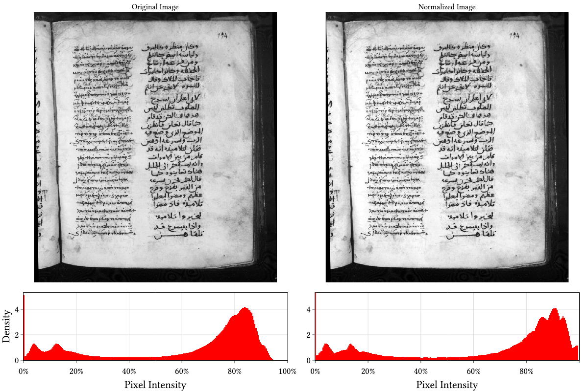

This page outlines code from a paper that Robert Turnbull gave at the [61st International Congress on Medieval Studies](https://wmich.edu/medievalcongress).
Over the years, I’ve had to learn a variety of techniques for processing manuscript images using open-source software, and I hope that some of the tips and tricks I share will be useful for you as well. You do not need to work specifically with manuscript images to benefit from these tools. Many of the techniques I discuss are also useful for working with digital images of printed documents and other archival materials.

More information will be provided in the published version of this paper.

The examples in this tutorial use Unix-style command-line conventions and should work directly on Linux and macOS systems. Windows users can either adapt the commands to PowerShell or use a Unix-like shell environment such as Windows Subsystem for Linux, Git Bash, or Cygwin.

```{=html}
<div style="position: relative; padding-bottom: 56.25%; height: 0; overflow: hidden; max-width: 100%;">
  <iframe
    src="https://www.youtube.com/embed/4XD-OcynE7I"
    title="YouTube video player"
    style="position: absolute; top: 0; left: 0; width: 100%; height: 100%; border: 0;"
    allow="accelerometer; autoplay; clipboard-write; encrypted-media; gyroscope; picture-in-picture; web-share"
    allowfullscreen>
  </iframe>
</div>
```

## Case Study

The example manuscript is Jerusalem Hagios Stavros 26, an eleventh-century Greek-Arabic lectionary on parchment, also known by the Gregory-Aland number L1023. The Greek text appears in the left column and the Arabic text in the right, with the manuscript ordered from left to right. For more detail, see [*Codex Sinaiticus Arabicus and Its Family*](https://brill.com/display/title/69300).

The manuscript was microfilmed by a Library of Congress expedition led by [Kenneth Clark](https://doi.org/10.2307/1355785) in 1949 and 1950. These images are now digitised, in the public domain, and available through the [Library of Congress website](https://www.loc.gov/resource/amedmonastery.00279395517-jo).

{#fig-loc width="100%"}

## Downloading

We will use [Wget](https://www.gnu.org/software/wget/) to download images from the command line. Its basic pattern is:

```bash
wget "$url" -O "$output"
```

The Library of Congress serves the images through the [International Image Interoperability Framework (IIIF)](https://doi.org/10.2352/issn.2168-3204.2015.12.1.art00005). The URLs have a predictable base:

```bash
https://tile.loc.gov/image-services/iiif/service:amed:amedmonastery:00279395517-jo
```

The suffix includes a zero-padded page number:

```bash
:0001/full/pct:100/0/default.jpg
```

To download these images, create a new directory:

```bash
mkdir -p Stavros26-LOC
```

Single images may be downloaded as follows:

```bash
iiif_base="https://tile.loc.gov/image-services/iiif/"
resource_id="service:amed:amedmonastery:00279395517-jo"
base_url="${iiif_base}${resource_id}"
page="001"
url="${base_url}:0${page}/full/pct:100/0/default.jpg"
output="Stavros26-LOC/Stavros26_${page}.jpg"

wget "$url" -O "$output"
```

This saves the image into the new directory.

There are 377 images in the microfilm collection. A loop downloads them all:

```bash
for page in $(seq -w 1 377); do
    url="${base_url}:0${page}/full/pct:100/0/default.jpg"
    output="Stavros26-LOC/Stavros26_${page}.jpg"

    wget "$url" -O "$output"
    sleep 2
done
```

The `seq -w` command generates page numbers with leading zeros. `sleep 2` pauses between downloads, which is gentler on the image server.

{#fig-downloaded width="70%"}

## Splitting

Each microfilm image contains two manuscript pages in a single frame. Splitting them into individual pages makes later processing easier.

Because the gutter is consistently near the centre, [MSS Tools](https://doi.org/10.25592/uhhfdm.18366) can split the images automatically. Install it in a virtual environment:

```bash
python3 -m venv .venv
source .venv/bin/activate
pip install msstools
```

The `split-images` command separates left and right pages while preserving a small overlap around the gutter.

The simplest usage is:

```bash
msstools split-images \
    "Stavros26-split/Stavros26" \
    Stavros26-LOC/*.jpg
```

Here the overlap is reduced to 6%, the first three title-card images are skipped, and the margins are adjusted to centre the fold.

```bash
msstools split-images \
    "Stavros26-split/Stavros26" \
    Stavros26-LOC/*.jpg \
    --overlap 6 \
    --margin-left 160 --margin-right 40 \
    --skip 3
```

This manuscript is ordered left to right, which is the default. For right-to-left manuscripts, use `--rtl`.

To include recto and verso folio numbers in the output filenames, specify the first numbered recto page with `--recto`.

```bash
msstools split-images \
    "Stavros26-split/Stavros26" \
    Stavros26-LOC/*.jpg \
    --overlap 6 \
    --margin-left 160 --margin-right 40 \
    --skip 3 \
    --recto Stavros26_004.jpg=1
```

Additional `--recto` values correct irregular folio numbering. The `--ignore` option skips a duplicate image:

```bash
msstools split-images \
    "Stavros26-split/Stavros26" \
    Stavros26-LOC/*.jpg \
    --overlap 6 \
    --margin-left 160 --margin-right 40 \
    --skip 3 \
    --recto Stavros26_004.jpg=1 \
    --recto Stavros26_050.jpg=46 \
    --recto Stavros26_254.jpg=248 \
    --recto Stavros26_255.jpg=250 \
    --ignore Stavros26_296.jpg
```

The result is a set of single-page images with folio numbers in the filenames.

::: {#fig-split layout-ncol=2}


Image `Stavros26-LOC/Stavros26_255.jpg` split into two files.
:::

## Deskewing

Some pages are slightly skewed, so the text lines do not run horizontally.

::: {#fig-deskew layout-ncol=2}


Deskewing f. 295v.
:::

We will use Stéphane Brunner's [`deskew`](https://github.com/sbrunner/deskew) utility. It estimates page angle using edge detection and a [Hough line transform](https://doi.org/10.1145/361237.361242).

```bash
pip install deskew
```

First, detect the skew angle:

```bash
deskew Stavros26-split/Stavros26-597-295v.jpg
```

Then correct the image:

```bash
mkdir -p Stavros26-deskewed
file=Stavros26-597-295v.jpg
deskew Stavros26-split/$file -o Stavros26-deskewed/$file
```

The same operation can be applied to the full collection:

```bash
mkdir -p Stavros26-deskewed
for file in $(ls Stavros26-split); do
    deskew "Stavros26-split/$file" -o "Stavros26-deskewed/$file"
done
```

The corrected images are written to `Stavros26-deskewed`.

## Autocrop

We can remove much of the black microfilm border automatically with ImageMagick.

On macOS, ImageMagick can be installed using Homebrew:

```bash
brew install imagemagick
```

On Linux, install it with the system package manager, for example:

```bash
apt install imagemagick
```

To crop the page, first detect a bounding box around the area to keep.

Store the input path in a variable:

```bash
input=Stavros26-deskewed/Stavros26-597-295v.jpg
```

Ask ImageMagick to detect the bounding box:

```bash
bounding_box=$(magick "$input" -fuzz 30% -format "%@" info:)
```

The `-fuzz 30%` option allows pixels similar to the edge colour to count as background.

The result is stored as a string such as `3194x3903+174+138`, meaning width, height, x start, and y start. Split those values into variables:

```bash
IFS='x+' read width height x_start y_start <<< "$bounding_box"
x_end=$((x_start + width))
y_end=$((y_start + height))
```

Use these values to draw the detected box:

```bash
magick "$input" \
  -stroke red \
  -strokewidth 20 \
  -fill none \
  -draw "rectangle $x_start,$y_start $x_end,$y_end" \
  "Stavros26-597-295v-bounding-box-default.jpg"
```

Small microfilm artifacts can prevent a tight crop.

{#fig-bbox-default width="55%"}

To ignore those artifacts, threshold the image and remove small specks before detecting the box:

```bash
bounding_box=$(magick "$input" \
  -colorspace Gray \
  -threshold 30% \
  -morphology Open Disk:5 \
  -format "%@" info:)

IFS='x+' read width height x_start y_start <<< "$bounding_box"
x_end=$((x_start + width))
y_end=$((y_start + height))
```

Draw the improved box onto the original image:

```bash
magick "$input" \
  -stroke red \
  -strokewidth 20 \
  -fill none \
  -draw "rectangle $x_start,$y_start $x_end,$y_end" \
  "Stavros26-597-295v-bounding-box-open-disk.jpg"
```

This gives a tighter box around the manuscript page.

::: {#fig-open-disk layout-ncol=2}


Thresholding and morphology improve the automatically detected bounding box.
:::

Finally, add a 100-pixel margin and crop all images:

```bash
margin=100
mkdir -p Stavros26-cropped

for file in $(ls Stavros26-deskewed); do
    input=Stavros26-deskewed/$file
    output=Stavros26-cropped/$file
    bounding_box=$(magick "$input" \
        -colorspace Gray \
        -threshold 30% \
        -morphology Open Disk:5 \
        -format "%@" info:)

    IFS='x+' read width height x_start y_start <<< "$bounding_box"

    # Add margin
    width=$(( width + 2*margin ))
    height=$(( height + 2*margin ))
    x_start=$(( x_start - margin ))
    y_start=$(( y_start - margin ))

    # Clamp to image bounds
    (( x_start < 0 )) && x_start=0
    (( y_start < 0 )) && y_start=0

    # Crop the image
    magick "$input" \
        -crop "${width}x${height}+${x_start}+${y_start}" \
        +repage \
        "$output"
done
```

The cropped images are written to `Stavros26-cropped`.

## Contrast

Microfilm images often benefit from automatic contrast adjustment. ImageMagick's `-normalize` option stretches the tonal range so that dark pixels become darker and light pixels become lighter.

For example:

```bash
input=Stavros26-cropped/Stavros26-392-194r.jpg
output=Stavros26-392-194r-normalized.jpg
magick "$input" -normalize "$output"
```

The histograms show the distribution of pixel brightness before and after normalization.

{#fig-normalization width="100%"}

To normalize the full collection, use a loop:

```bash
mkdir -p Stavros26-normalized

for file in $(ls Stavros26-cropped); do
    input=Stavros26-cropped/$file
    output=Stavros26-normalized/$file

    magick "$input" -normalize "$output"
done
```

The normalized images are written to `Stavros26-normalized`.

## PDF Collation

After processing, the images can be combined into a PDF. ImageMagick can do this directly:

```bash
magick Stavros26-normalized/*.jpg Stavros26.pdf
```

ImageMagick re-encodes the JPEG files. To avoid that, MSS Tools can combine the images with `img2pdf` and add PDF bookmarks from the filenames:

```bash
msstools combine \
    Stavros26-normalized/*.jpg \
    Stavros26.pdf \
    --strip-pattern "Stavros26-"
```

The `--strip-pattern` option removes the filename prefix so the page and folio numbers become cleaner bookmarks.

## PDF Extraction

If a manuscript is already in a PDF, `pdfimages` can extract the embedded images.

On macOS, this can be installed with Homebrew:

```bash
brew install poppler
```

On Linux, install it with:

```bash
apt install poppler-utils
```

On Windows, [precompiled binaries](https://github.com/oschwartz10612/poppler-windows) are available.

To extract the images from a PDF, run:

```bash
mkdir -p Stavros26-extracted
pdfimages -all Stavros26.pdf Stavros26-extracted/Stavros26-extracted
```

This extracts images from `Stavros26.pdf` using the output prefix given at the end. If the PDF was created without re-encoding the JPEGs, the extracted files should match the embedded originals.

## Conclusion

For more information, see the published version of this paper when it is available or contact [Robert Turnbull](https://robturnbull.com).

## Acknowledgements

This work was completed as part of the [BICROSS project](https://theo.kuleuven.be/en/research/research_units/ru_bible/lemma/bicross-project), 
which has received funding from the European Research Council (ERC) 
under the European Union’s Horizon Europe research and innovation programme 
(grant agreement no. 101043730 – BICROSS – ERC-2021-COG). 
Views and opinions expressed are however those of the authors only and do not 
necessarily reflect those of the European Union or the European Research Council. 
Neither the European Union nor the granting authority can be held responsible for them. 
The original version of this tutorial was given as an invited presentation at the 
[61st International Congress on Medieval Studies](https://icms.confex.com/icms/2026/meetingapp.cgi) at Kalamazoo on May 16, 2026.

## Licence

This tutorial and its code examples are licensed under a [Creative Commons Attribution 4.0 International License](https://creativecommons.org/licenses/by/4.0/).
